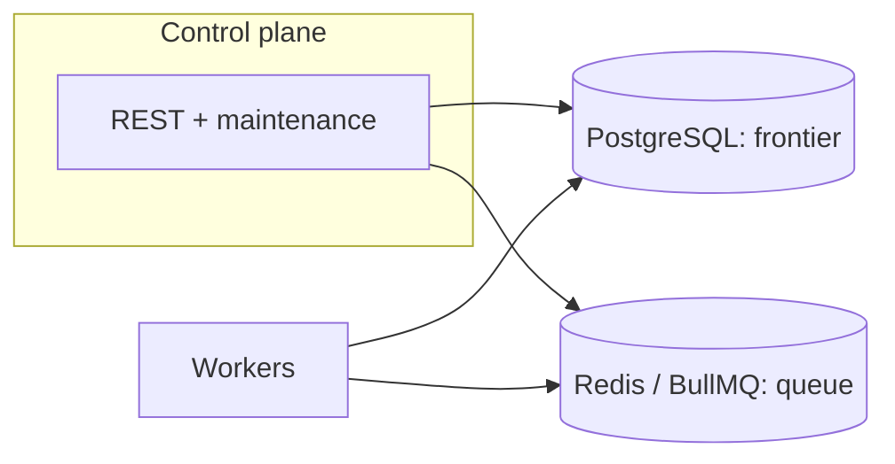

# Distributed Web Crawler

> **Status:** Work in progress — usable now, not final yet.

This repository is a small distributed crawler built to explore a specific systems question: how to keep crawl state durable and inspectable while work is executed asynchronously across multiple workers.

In this implementation, Postgres stores the canonical frontier, Redis/BullMQ handles job dispatch, and a control plane runs reconciliation plus stale-lease recovery. The scope is intentionally narrower than a full production crawler; the focus is on making concurrency and failure behavior explicit and testable.

The main question in this repo is not raw crawl throughput. It is whether this design preserves clear invariants under concurrency: one logical URL row per run, atomic claiming, recovery of stranded work, and stable completion based on frontier state rather than transient queue emptiness.



**Flow:** the control plane reads and updates Postgres, publishes jobs to Redis, and runs **reconciliation + lease-based stale recovery** so `QUEUED` rows are re-published and stale `IN_PROGRESS` rows can be reclaimed. Workers **consume Redis jobs, claim rows atomically in Postgres, fetch and parse, then write frontier updates back to Postgres**.

## What this repo demonstrates

- Durable crawl frontier state in Postgres (`crawl_runs`, `crawl_urls`) with queryable run metadata.
- Async execution transport through Redis/BullMQ while frontier correctness remains DB-enforced.
- Atomic `QUEUED -> IN_PROGRESS` claims ensure that at most one worker processes a given row at a time, even if the same job is delivered multiple times. This prevents concurrent duplicate processing, while allowing retries after failures (at-least-once semantics).
- Reconciliation that re-enqueues `QUEUED` rows if Redis publication was missed.
- Lease-based recovery (`claimed_at`, `claimed_by_worker`) for stale in-flight work.
- Completion is determined from frontier state (`QUEUED=0`, `IN_PROGRESS=0`) observed across consecutive maintenance cycles, rather than queue emptiness.

## Scope and limitations

- This implementation is not a web-scale crawler and is intended for local/demo/review environments.
- No JavaScript rendering pipeline; responses are fetched as HTTP documents and parsed with Cheerio.
- No robots.txt / crawl-delay / advanced distributed politeness scheduler.
- URL normalization is intentionally conservative and documented in this README.
- Host scope is intentionally narrow per run (`seed host` plus optional `www` counterpart only).
- Correctness properties are relative to the documented normalization and allowed-host rules.

## Design choices in this implementation

- **Postgres as canonical frontier** — In this repo, `crawl_urls` is the durable dedup and state-transition store, so run state is queryable and exportable.
- **BullMQ as execution transport** — BullMQ is used here for dispatch and delayed retries; duplicate queue delivery is expected and resolved at DB claim time.
- **Reconciliation instead of outbox** — This implementation accepts best-effort enqueue-after-commit and compensates for that gap with periodic re-enqueue of `QUEUED` rows.
- **Lease-based ownership (`claimed_at`, `claimed_by_worker`)** — Worker loss is handled by reclaiming stale `IN_PROGRESS` rows during maintenance.
- **Per-run host scope** — `allowed_hosts` is derived from the seed (apex + `www.` pair only); link filtering is deterministic per run.
- **Idempotent URL discovery + atomic claim** — Idempotent insertion (via uniqueness constraint) combined with atomic claim ensures one logical URL row per run.
- **Explicit completion rule** — Run completion is driven by a stable-empty frontier check (`QUEUED=0`, `IN_PROGRESS=0` across consecutive cycles).

## Correctness properties

Under the **documented normalization and per-run host scope** (derived from the seed URL), this implementation is designed so that:

These properties cover both safety (no concurrent duplicate row-level processing) and liveness (eventual completion under bounded retries and stable conditions).

- **Discovered URLs are durably stored in Postgres once inserted, and reconciliation plus lease recovery ensure they are not permanently stranded.**
- **Duplicate discoveries are deduplicated at insert time via a uniqueness constraint, and atomic claiming ensures that only one worker processes a row at a time.**
- **Multi-worker execution converges to the same normalized URL set as single-worker execution under the same normalization and host-scope rules.**
- **Under bounded retries and stable dependencies, frontier rows transition to terminal states (`VISITED` or `FAILED`), allowing the run to complete.**

Reviewers can verify these properties using the export/summary APIs, the E2E fixture tests, and the comparison workflow (`npm run compare-results`).

**Mechanisms reviewers can rely on:** DB uniqueness, **atomic claim**, **reconciliation loop**, **lease-based recovery**, and the **export comparison** workflow.

## Stack

- TypeScript + Node.js
- PostgreSQL (crawl state)
- Redis + BullMQ (queue)
- Docker Compose
- Prometheus (optional local observability)

## Architecture overview

See [docs/architecture.md](docs/architecture.md) for a URL state machine, data model notes, and deeper rationale.

**Roles**

- **Control plane**: REST API, periodic maintenance (stale lease recovery + reconciliation), stable completion detection, Prometheus `/metrics`.
- **Workers**: BullMQ consumers, gated HTTP fetch + HTML link extraction, DB writes, Prometheus `/metrics` on `9091` by default.
- **Postgres**: canonical frontier (`crawl_urls`) and run metadata (`crawl_runs`).
- **Redis/BullMQ**: schedules `{ crawl_run_id, url_id }` jobs; duplicates are acceptable because claim is atomic.

### Crawl lifecycle (summary)

1. `POST /crawl-runs` with `seedUrl` creates the run, inserts the normalized seed as `QUEUED`, and best-effort enqueues.
2. Worker atomically claims `QUEUED → IN_PROGRESS` (lease: `claimed_at`, `claimed_by_worker`).
3. On success: persist HTTP metadata, mark `VISITED`, insert discovered children (`raw_url`, `discovered_from_url_id`) with dedup constraint.
4. On retryable failure: `IN_PROGRESS → QUEUED` with backoff delay and BullMQ delayed job.
5. Control plane maintenance: recover stale leases; re-enqueue all `QUEUED` rows (compensates for the DB-commit / enqueue gap).
6. Completion: empty frontier (`QUEUED=0`, `IN_PROGRESS=0`) for **two consecutive** maintenance cycles after recovery + reconciliation.

### URL normalization / filtering policy

- Resolve relative URLs against the parent page.
- Only `http`/`https`.
- Strip `#fragments`; strip default ports (`:443`, `:80`).
- Preserve query strings as-is (no aggressive canonicalization).
- Ignore `mailto:`, `tel:`, `javascript:`.
- **Host scope is per crawl run**, stored on `crawl_runs.allowed_hosts`: the **seed hostname** plus its **single `www.` counterpart** when applicable (e.g. seed `https://example.com/` → `example.com` and `www.example.com`; seed `https://www.example.com/` → those same two). Other subdomains (e.g. `cdn.example.com`) are rejected.

### Retry policy

- **2xx + HTML**: parse links, insert children, mark `VISITED`.
- **2xx non-HTML**: mark `VISITED`, no link extraction.
- **5xx, 429**: retryable with exponential backoff; **429** uses `RETRY_429_MULTIPLIER` on top of the base backoff.
- **Most other 4xx**: terminal `FAILED`.
- **Transient network/DNS/timeouts**: retryable (bounded by `MAX_RETRIES`).

### Completion detection

After each maintenance cycle: recover stale → reconcile → read counts → update stable-empty streak → mark `COMPLETED` only when streak reaches 2.

## Data model highlights

`crawl_runs` includes: `seed_url` (caller input), `normalized_seed_url`, `root_url` (canonical normalized seed, same value as `normalized_seed_url`), **`allowed_hosts`** (text array used for link filtering), plus status and counters.

`crawl_urls` includes: `normalized_url`, optional `raw_url` (href as seen), optional `discovered_from_url_id`, lease fields, HTTP metadata, retries, timestamps.

## API reference (inspection)

| Method | Path | Purpose |
|--------|------|---------|
| `POST` | `/crawl-runs` | Start a crawl (JSON body **`{ "seedUrl": "<absolute http(s) URL>" }`** — required) |
| `GET` | `/crawl-runs/:id` | Status + triggers one maintenance pass |
| `GET` | `/crawl-runs/:id/summary` | Aggregates + run meta |
| `GET` | `/crawl-runs/:id/urls` | Paginated URL rows (`status`, `limit`, `offset`, `sort`, `order`) |
| `GET` | `/crawl-runs/:id/export?format=json\|csv` | Export sample (default `limit=50000`, includes `id` + lineage fields) |
| `GET` | `/crawl-runs/:id/graph` | Discovery edge list (`discovered_from_url_id → id`) for lineage inspection |
| `GET` | `/metrics` | Prometheus (control-plane) |
| `GET` | `/health` | Liveness |

### Start a crawl (`POST /crawl-runs`)

```bash
curl -sS -X POST http://localhost:3000/crawl-runs \
  -H "Content-Type: application/json" \
  -d '{"seedUrl":"https://example.com/"}'
```

The response includes `id`, `seed_url`, `normalized_seed_url`, `allowed_hosts`, `root_url`, and `status`. `GET /crawl-runs/:id` and `GET /crawl-runs/:id/summary` echo the same scope fields from Postgres.

### URL list pagination

`GET /crawl-runs/:id/urls?status=VISITED&limit=50&offset=0&sort=visited_at&order=desc`

- `sort`: `id` \| `visited_at` \| `updated_at` \| `normalized_url`
- `order`: `asc` \| `desc`
- Response includes `pagination.total`, `returned`, `has_more`.

### Export

JSON:

```bash
curl -sS "http://localhost:3000/crawl-runs/1/export?format=json&limit=50000" -o run1.json
```

CSV:

```bash
curl -sS "http://localhost:3000/crawl-runs/1/export?format=csv&limit=50000" -o run1.csv
```

## Observability

The repo includes local observability support through Prometheus metrics on both processes and structured worker logs with `crawl_run_id` / `url_id`. These signals are intended to make queueing, retries, lease recovery, and maintenance behavior visible during runs.

**Endpoints**

- Control plane: `http://localhost:3000/metrics`
- Worker (Compose network): `http://worker:9091/metrics` (map the port on the host if needed)
- Prometheus UI: `http://localhost:9090` (see `docker-compose.yml`)

Full narrative + failure-mode table: **[docs/observability.md](docs/observability.md)**.

### What the key metrics mean

| Metric | What it measures |
|--------|-------------------|
| `crawl_fetch_duration_seconds` (worker histogram) | Time from starting the gated HTTP request until response headers are available. |
| `crawl_processing_duration_seconds` (worker histogram) | Wall time **after a successful claim** for the whole job (body read, parse, DB writes, enqueue children). |
| `crawl_queue_latency_seconds` (worker histogram) | `now - job.timestamp` when the job starts—queueing + scheduling delay before your worker thread picks it up. |
| `crawl_urls_retried_total` / `crawl_urls_failed_total` | Retry vs terminal failure pressure on the frontier. |
| `crawl_stale_claims_recovered_total` | How often lease expiry saved work that would otherwise look “stuck in flight.” |
| `crawl_queue_reconciliation_*` | How aggressively the control plane is re-publishing `QUEUED` rows—your “enqueue gap” safety valve. |
| `crawl_reconciliation_cycle_duration_seconds` (control plane) | Cost of one full maintenance sweep across active runs. |
| `processed_urls_total` (worker counter) | One tick per **claimed** URL job after `processJob` finishes (visited, failed, or re-queued for retry)—a coarse “we actually handled claimed work” counter. |

### Interpreting the metrics

- If **`crawl_fetch_duration_seconds` p95/p99 jumps** while processing stays flat → likely **network/TLS/origin slowness** (or saturation below your fetch gate), not your HTML/DB path.
- If **`crawl_urls_retried_total` accelerates** with erratic fetch latency → **target instability** (5xx/429/timeouts) or aggressive rate limits; check classification and backoff settings.
- If **`crawl_queue_reconciliation_*` churn rises** faster than `crawl_urls_visited_total` → **queue/Redis instability or worker starvation**: Postgres still has `QUEUED` rows, but work is not draining smoothly—pair with `crawl_queue_latency_seconds` and worker logs for the same `crawl_run_id`.
- If **`crawl_stale_claims_recovered_total` spikes** after deploys or OOMs → **workers died mid-claim**; leases are doing their job—verify worker restarts and capacity.

## Operator scripts

Located in `scripts/` (executable):

| Script | Purpose |
|--------|---------|
| `scripts/crawl-start.sh <seedUrl>` | `POST /crawl-runs` with JSON body (requires `node` on `PATH`) |
| `scripts/crawl-summary.sh <id>` | `GET /crawl-runs/:id/summary` (expects `jq`) |
| `scripts/crawl-visited-sample.sh <id> [limit]` | Recent visited URLs |
| `scripts/compare-crawl-exports.sh a.json b.json` | Set diff on `normalized_url` (bash / `comm`) |

Environment: `CRAWLER_API` (default `http://localhost:3000`).

### Automated export comparison (recommended)

TypeScript comparator (exit code **1** on mismatch):

```bash
npm install
npm run compare-results -- run-a.json run-b.json
```

## Single-worker vs multi-worker comparison

Goal: show the **normalized URL set** is the same under the same rules.

1. `docker compose up --build --scale worker=1 -d`
2. Start a crawl with an explicit seed, wait for `COMPLETED`, export JSON (`/export`), e.g. `scripts/crawl-start.sh 'https://example.com/'` (or `https://ipfabric.io/` for the original assignment target).
3. `docker compose up --scale worker=3 -d` (or tear down volume if you need a fresh DB—same DB run is optional).
4. Second crawl export.
5. `npm run compare-results -- run1.json run2.json` (or `scripts/compare-crawl-exports.sh`) — expect **identical normalized URL sets for deterministic fixtures and stable sites (modulo external site drift)**.

Trade-off: real sites can change between runs; for demos, run back-to-back or use a fixed snapshot environment.

## What reviewers can verify

- Duplicate queue delivery does not create duplicate URL rows because dedup + atomic claim gates processing.
- Stale `IN_PROGRESS` work can be reclaimed through lease expiry and maintenance.
- `QUEUED` rows missing from Redis are re-enqueued by reconciliation.
- Multi-worker exports can be compared to single-worker exports under the same fixture/rules.
- Completion depends on stable frontier state (`QUEUED=0`, `IN_PROGRESS=0` across checks), not transient queue emptiness.

## Demo UI (phase 2)

A minimal observability UI is served by the control plane at `http://localhost:3000/ui/`.

- Enter a `seedUrl` and click **Start Crawl**.
- The page shows `crawl_run_id`, run status, summary counters, a live lineage graph, and a live URL table (`id`, `normalized_url`, `status`, `discovered_from_url_id`, `last_error`).
- The graph uses lineage edges from `/crawl-runs/:id/graph` and node status metadata from `/crawl-runs/:id/urls`.
- Phase 2 still uses polling (`/crawl-runs/:id/summary` + `/crawl-runs/:id/urls` + `/crawl-runs/:id/graph`) every ~1.5s and stops when the run reaches a terminal status.

This UI is intentionally lightweight and demo-focused. The polling transport is isolated so it can be replaced with SSE later without a large rewrite.

If you want visuals in project docs later, add screenshots/GIFs under `docs/images/` and link them from this section.

## Tests

```bash
npm install
npm test
```

Vitest tests live in `packages/shared` for:

- **normalization + host filtering** (`url.ts`, no DB side effects)
- **retry / HTTP classification** (`classification.ts`)
- **reconciliation job builder** (`reconciliation.ts`)
- **Postgres semantics** for dedup + atomic claim using **in-memory `pg-mem`** (`dbConcurrency.pgmem.test.ts`)

## End-to-end correctness tests

These tests drive the **real control-plane API** against **local static HTML fixtures** served from the host, so expected URL sets and status totals are **known exactly** (unlike live sites, which drift and hide edge cases).

- **Fixed fixtures** (`tests/e2e/fixed-fixtures.test.ts`) — small hand-written graphs: single page, duplicate + fragment + external link, broken link (404), cycle, and an optional **www / host-scope** case (`E2E_WWW=1`).
- **Seeded graphs** (`tests/e2e/generated-graph.test.ts`) — deterministic random HTML graphs (default seeds `42424` and `91817`; page count `E2E_GRAPH_PAGES`, default 11). On failure the run prints `TEST_GRAPH_SEED` so you can rerun with the same value.
- **Worker equivalence** — `scripts/e2e-worker-equivalence.sh` rescales Compose workers, runs two exports of the same fixture, and runs `npm run compare-results`. Alternatively, set `E2E_EXPORT_A` and `E2E_EXPORT_B` to two export JSON paths and run `vitest run --config vitest.e2e.config.ts tests/e2e/worker-equivalence-exports.test.ts`.

**Prerequisites:** `docker compose up --build -d` (control plane + Postgres + Redis + **worker**). The worker image includes `extra_hosts: host.docker.internal:host-gateway` so it can fetch fixtures; the harness serves on `0.0.0.0` and uses seed URLs like `http://host.docker.internal:<port>/…` (override with `E2E_FIXTURE_HOST=127.0.0.1` if both the API and the worker run on the host, not in Docker).

```bash
npm install
npm run build -w @crawler/shared   # tests import @crawler/shared
npm run test:e2e                   # all E2E (fixed + generated + skipped export compare)
npm run test:e2e:fixed
npm run test:e2e:generated
```

**Rerun one failing generated case:**

```bash
TEST_GRAPH_SEED=91817 npm run test:e2e:generated
```

## Run with Docker Compose

Images compile TypeScript during `docker compose build` (`npm ci` + workspace `tsc`); you do **not** need a host-built `dist/` before starting containers. Runtime entrypoints are `node services/control-plane/dist/index.js` and `node services/worker/dist/index.js`.

```bash
docker compose up --build -d
docker compose up --scale worker=3 -d
```

### Migrations (existing volume)

```bash
docker compose exec -T postgres psql -U crawler -d crawler < db/migrations/001_p0_hardening.sql
docker compose exec -T postgres psql -U crawler -d crawler < db/migrations/002_p1_discovered_raw.sql
docker compose exec -T postgres psql -U crawler -d crawler < db/migrations/003_crawl_scope.sql
```

Fresh volumes pick up `db/init.sql` automatically.

### Prometheus

After `docker compose up`, open **http://localhost:9090** → Status → Targets (verify `control-plane` and `worker` are UP).

**Note:** With `docker compose --scale worker=N`, Prometheus may resolve `worker` to one replica depending on DNS; for strict per-replica metrics, add service discovery or separate worker services. For demos, `scale worker=1` is the most predictable.

## Local development

```bash
npm install
npm run build
npm run dev:control-plane
npm run dev:worker
```

Worker metrics server listens on `WORKER_METRICS_PORT` (default `9091`).

## Fetch concurrency / politeness (lightweight)

Workers still use BullMQ `WORKER_CONCURRENCY` for **how many jobs run in parallel**, but outbound HTTP is additionally gated:

- `FETCH_CONCURRENCY` (default **4**): global in-process cap across concurrent jobs in one worker process.
- `FETCH_CONCURRENCY_PER_HOST` (default **2**): per-host cap (hostname from URL).

This is **not** a full distributed politeness system (no shared global token bucket across all workers). For stronger production politeness you would add cross-process rate limits (often Redis) or crawl budgets.

## Crawl lineage (graph)

Discovery relationships are stored on `crawl_urls.discovered_from_url_id`.

- **Edge list API**: `GET /crawl-runs/:id/graph?limit=100000`
- **Row-level fields** are also returned from `/urls` and `/export` (`discovered_from_url_id`, `raw_url`, `id`).

## Scaling snapshot

First bottlenecks are usually **Postgres write contention** on `crawl_urls`, **Redis/BullMQ throughput** for fan-out enqueue, **origin network latency** (especially when HTML is large), and **hot-domain skew** when many links point at the same host. At larger scale you would evolve **host/partition-aware sharding**, **read replicas or CQRS for inspection**, **stronger per-domain budgets**, and **optional transactional outbox** if you need to narrow reconciliation windows—see **[docs/scaling-and-bottlenecks.md](docs/scaling-and-bottlenecks.md)** and **[docs/design-tradeoffs.md](docs/design-tradeoffs.md)**.

## Scaling limits & trade-offs (docs)

- **[docs/scaling-and-bottlenecks.md](docs/scaling-and-bottlenecks.md)** — what breaks first at larger scale and what you would evolve next.
- **[docs/design-tradeoffs.md](docs/design-tradeoffs.md)** — why Postgres + BullMQ, why not Kafka / aggressive canonicalization / etc.

## Logging conventions

- Control plane: `[component=control-plane] crawl_run=<id> ...`
- Worker (per-URL path): `[worker worker_id=<id> crawl_run=<id> url_id=<id>] <event>`

## Remaining roadmap (intentionally later)

- Per-replica Prometheus service discovery for scaled workers
- Stronger distributed politeness (shared token buckets / per-domain budgets)
- Outbox / transactional enqueue if you want to narrow the reconciliation window further
- Content storage / WARC export
- Richer integration tests (Testcontainers) for full stack paths
