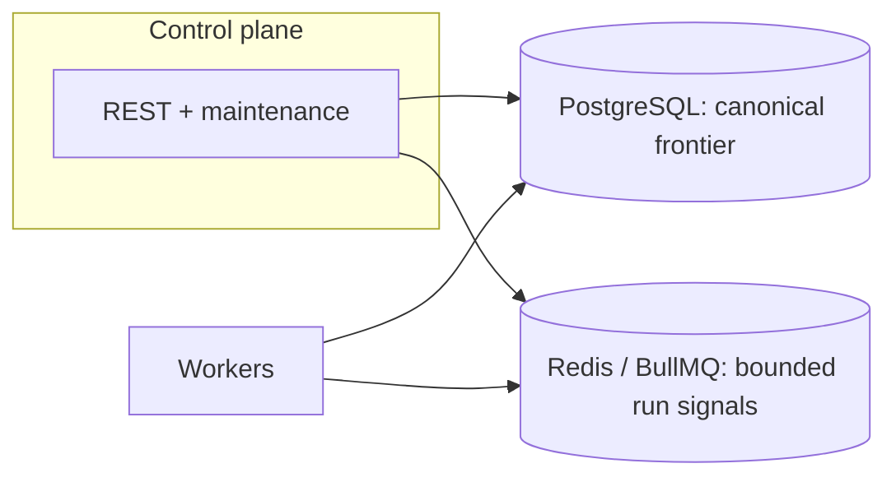
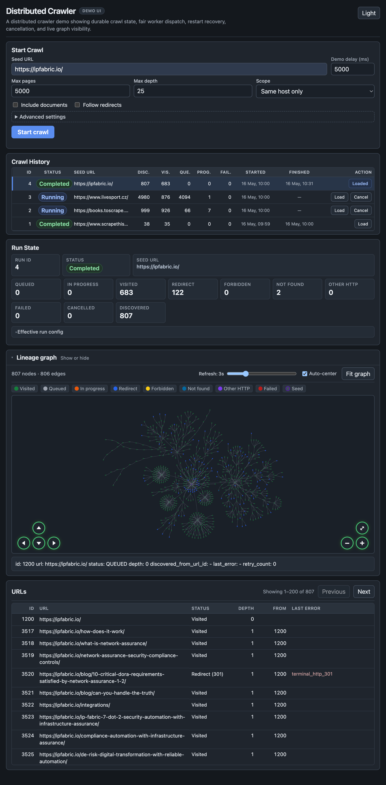
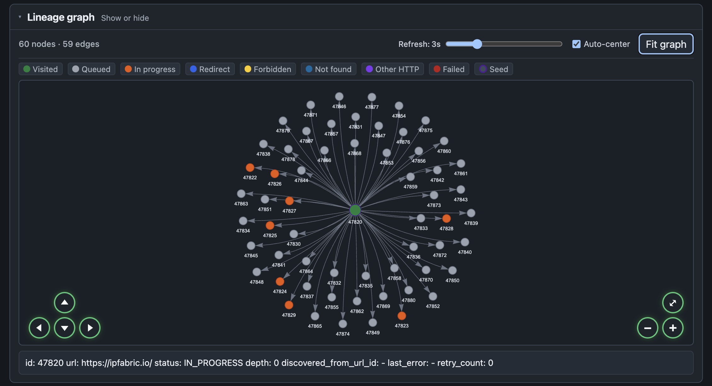
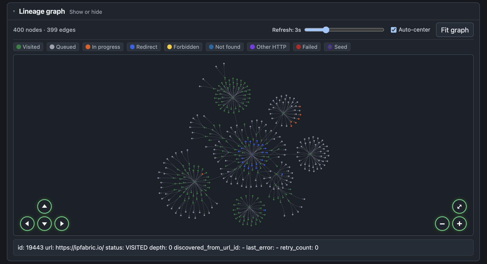
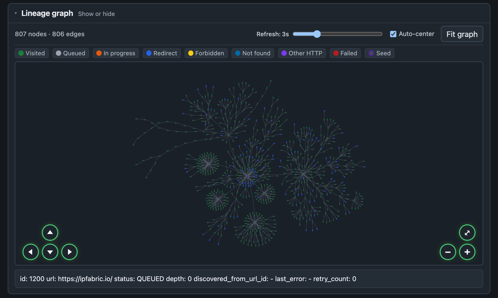
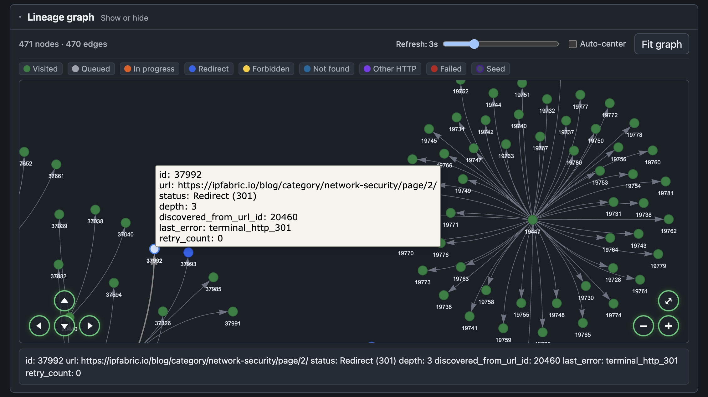
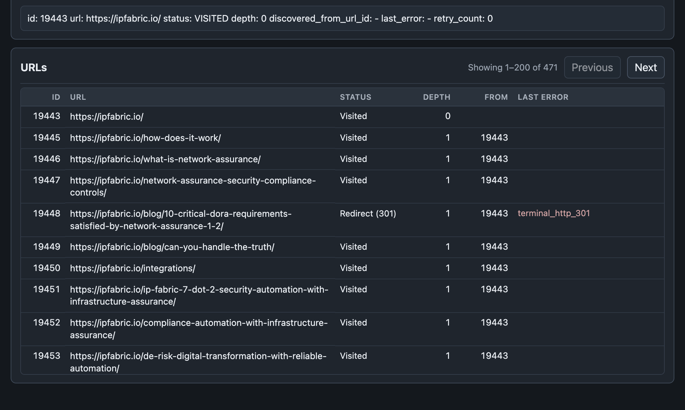

# Distributed Web Crawler

[](https://github.com/samuelhajnik/distributed-web-crawler/actions/workflows/ci.yml)

This repository is a distributed crawler focused on durable crawl state, bounded asynchronous dispatch, restart recovery, cancellation, and live crawl inspection.

Postgres owns the canonical crawl frontier. Redis/BullMQ is intentionally limited to a bounded dispatch signal layer rather than becoming a second copy of the frontier. Workers consume run-level signals and claim concrete URL work from Postgres at processing time. The control plane exposes run lifecycle APIs, reconciliation, stale-lease recovery, persisted crawl history, terminal cancellation, export/inspection endpoints, and a browser UI for observing the system while it runs.

The goal is not maximum crawl throughput. The goal is to make the important distributed-systems boundaries explicit and testable: one logical URL row per run, atomic claiming, retry eligibility stored in the database, recovery of stranded work, cancellation that prevents new claims, and completion based on durable frontier state rather than transient Redis queue emptiness.

The scope is intentionally narrower than a full production crawler, but the implementation is designed to make its trade-offs, failure modes, and correctness boundaries visible.



**Flow:** the control plane updates Postgres and tops up bounded BullMQ run signals when claimable work exists. Workers consume one signal at a time, atomically claim one eligible URL row from Postgres, then fetch, parse, and persist frontier updates. Discovery inserts child URLs into Postgres and triggers signal top-ups. Reconciliation and lease-based stale recovery keep work from being stranded, while completion is derived from durable frontier counts rather than Redis queue emptiness.



_Dark-theme dashboard showing crawl start controls, persisted crawl history, active run state, lineage graph, and URL inspection._

## What this repo demonstrates

- **Durable crawl frontier** — `crawl_runs` and `crawl_urls` store run metadata, URL state, lineage, retries, and terminal outcomes in Postgres.
- **Bounded async dispatch** — Redis/BullMQ carries run-level dispatch signals instead of mirroring every queued URL; workers claim concrete URL work from Postgres.
- **Concurrency-safe processing** — atomic `QUEUED → IN_PROGRESS` transitions ensure only one worker processes a URL row at a time, even under duplicate signal delivery.
- **Recovery and reconciliation** — stale leases are reclaimed and missing dispatch signals are topped up when claimable work exists.
- **Retry and cancellation semantics** — `retry_after_at` preserves per-URL backoff in Postgres; cancellation is terminal and prevents new claims for cancelled runs.
- **Operational demo UI** — crawl history, Load/Cancel actions, live run state, graph lineage, node details, URL table, and light/dark themes make the system inspectable during execution.

## Reviewer path

A quick path through the repo:

1. Bring the stack up (`docker compose up --build`; see **Run with Docker Compose**).
2. Start a crawl via the demo UI (`http://localhost:3000/ui/`), `POST /crawl-runs`, or `scripts/crawl-start.sh`; use **Crawl History → Load** to attach to an existing persisted run (restart recovery in the UI).
3. Inspect run state: `GET /crawl-runs/:id/summary`, the UI, or `scripts/crawl-summary.sh <id>`; cancel an active run with **`POST /crawl-runs/:id/cancel`** or the UI action when applicable.
4. Inspect URLs and lineage: **Demo UI**, `GET /crawl-runs/:id/urls`, `GET /crawl-runs/:id/graph`, or `/export`.
5. (Optional) Scale workers and compare exports—**Single-worker vs multi-worker comparison**, `npm run compare-results`, **End-to-end correctness tests**.

For design detail: [docs/architecture.md](docs/architecture.md). For metrics and failure modes: [docs/observability.md](docs/observability.md).

## Design choices in this implementation

- **Postgres as canonical frontier** — In this repo, `crawl_urls` is the durable dedup and state-transition store, so run state is queryable and exportable.
- **BullMQ as execution transport** — BullMQ carries bounded run signals and delayed wakeups; duplicate signal delivery is expected and resolved at DB claim time.
- **Reconciliation instead of outbox** — Best-effort enqueue-after-commit is paired with periodic **top-ups of bounded run signals** when Postgres still shows claimable `QUEUED` rows (not bulk URL-job replay).
- **Lease-based ownership (`claimed_at`, `claimed_by_worker`)** — Worker loss is handled by reclaiming stale `IN_PROGRESS` rows during maintenance.
- **Per-run host scope** — `allowed_hosts` is derived from the seed (apex + `www.` pair only); link filtering is deterministic per run.
- **Idempotent URL discovery + atomic claim** — Idempotent insertion (via uniqueness constraint) combined with atomic claim ensures one logical URL row per run.
- **Explicit completion rule** — Run completion is driven by a stable-empty frontier check (`QUEUED=0`, `IN_PROGRESS=0` across consecutive cycles).

## Correctness properties

Under the **documented normalization and per-run host scope** (derived from the seed URL), the implementation is designed to provide both safety and liveness properties:

- **Durable discovery:** discovered URLs are stored in Postgres once inserted, and reconciliation plus lease recovery keep claimable work from being permanently stranded.
- **Single-row ownership:** duplicate discoveries are deduplicated at insert time, and atomic claiming ensures only one worker processes a URL row at a time.
- **Deterministic comparison path:** multi-worker execution converges to the same normalized URL set as single-worker execution under the same normalization and host-scope rules.
- **Completed frontier semantics:** under bounded retries and stable dependencies, active frontier rows (`QUEUED`, `IN_PROGRESS`) transition into completed row states such as `VISITED`, `REDIRECT_FOLLOWED`, non-expanding redirect/HTTP outcomes, `FAILED`, or **`CANCELLED`** after cancellation. This allows the run to reach a terminal run status when active work is stably drained.

Reviewers can verify these properties using the export/summary APIs, the E2E fixture tests, and the comparison workflow (`npm run compare-results`).

**Mechanisms reviewers can rely on:** DB uniqueness, **atomic claim**, **`retry_after_at` eligibility**, **bounded run-signal reconciliation**, **lease-based recovery**, and the **export comparison** workflow.

## Scope and limitations

- This implementation is not a web-scale crawler and is intended for local/demo/review environments.
- No JavaScript rendering pipeline; responses are fetched as HTTP documents and parsed with Cheerio.
- Workers use simple **browser-like default HTTP headers** on outbound fetches (`User-Agent`, `Accept`, `Accept-Language`; encoding negotiation is left to the HTTP stack). Set **`CRAWLER_USER_AGENT`** to override the default User-Agent string.
- No **robots.txt** support and no advanced **distributed/global** politeness scheduler.
- The worker does include **lightweight, process-local** host pacing/cooldown (spacing and backoff per hostname within one process) for live-site stability — not a crawl-delay engine and not coordinated across replicas.
- URL normalization is intentionally conservative and documented in this README.
- Host scope is intentionally narrow per run (`seed host` plus optional `www` counterpart only).
- Correctness properties are relative to the documented normalization and allowed-host rules.

## Stack

- TypeScript + Node.js
- PostgreSQL (crawl state)
- Redis + BullMQ (queue)
- Docker Compose
- Prometheus (optional local observability)

## Architecture overview

See [docs/architecture.md](docs/architecture.md) for a URL state machine, data model notes, and deeper rationale.

**Roles**

- **Control plane**: REST API, periodic maintenance (stale lease recovery + reconciliation), stable completion detection, Prometheus `/metrics`.
- **Workers**: BullMQ consumers, gated HTTP fetch + HTML link extraction, DB writes, Prometheus `/metrics` on `9091` by default.
- **Postgres**: canonical frontier (`crawl_urls`) and run metadata (`crawl_runs`).
- **Redis/BullMQ**: carries bounded run-level dispatch signals (payload is **`crawlRunId` + slot index**, never a URL id); workers claim concrete URL work from Postgres at processing time. BullMQ is not a full copy of the frontier.

### Crawl lifecycle (summary)

1. `POST /crawl-runs` with `seedUrl` creates the run, inserts the normalized seed as `QUEUED`, and enqueues bounded run-level dispatch signals.
2. Worker atomically claims `QUEUED → IN_PROGRESS` (lease: `claimed_at`, `claimed_by_worker`).
3. On success: persist HTTP metadata, mark `VISITED`, insert discovered children (`raw_url`, `discovered_from_url_id`) with dedup constraint.
4. On retryable failure: `IN_PROGRESS → QUEUED` with `retry_after_at` backoff and a delayed run-level signal.
5. Control plane maintenance: recover stale leases; top up bounded run signals when claimable `QUEUED` rows exist (compensates for the DB-commit / enqueue gap).
6. Completion: empty frontier (`QUEUED=0`, `IN_PROGRESS=0`) for **two consecutive** maintenance cycles after recovery + reconciliation.

### URL normalization / filtering policy

- Resolve relative URLs against the parent page.
- Only `http`/`https`.
- Strip `#fragments`; strip default ports (`:443`, `:80`).
- Preserve query strings as-is (no aggressive canonicalization).
- Ignore `mailto:`, `tel:`, `javascript:`.
- **Host scope is per crawl run**, stored on `crawl_runs.allowed_hosts`: the **seed hostname** plus its **single `www.` counterpart** when applicable (e.g. seed `https://example.com/` → `example.com` and `www.example.com`; seed `https://www.example.com/` → those same two). Other subdomains (e.g. `cdn.example.com`) are rejected.

### Retry policy

HTTP outcomes are classified in `packages/shared` (`classifyHttpResponse`); transport/runtime outcomes use `classifyExecutionError`. URL-level retries are bounded by per-run **`maxRetries`** (defaults from env **`MAX_RETRIES`** via the control plane).

**`retry_after_at` (Postgres):** On retryable failure the worker sets the row back to `QUEUED`, bumps `retry_count`, and writes **`retry_after_at = now + delay`**. **`claimNextQueuedUrl`** (and equivalent SQL) only selects **`QUEUED`** rows whose **`retry_after_at` is null or ≤ now**, so backoff semantics stay correct even though BullMQ only carries **run-level** signals. A **delayed BullMQ wake signal** may also be scheduled so workers revisit the run near eligibility time; missing wakes still converge via reconciliation + claim rules.

- **2xx + HTML**: parse links, insert children, mark `VISITED`.
- **2xx non-HTML**: mark `VISITED`, no link extraction.
- **301**: terminal `REDIRECT_301`.
- **403**: terminal `FORBIDDEN` (request completed; access denied by target).
- **404**: terminal `NOT_FOUND`.
- **5xx**: classified **retryable**; the URL is re-queued with backoff until **`maxRetries`** is exhausted, then terminal **`HTTP_TERMINAL`**.
- **408**, **421**, **425**, **429**: classified **retryable** like **5xx**; the URL is re-queued with backoff until **`maxRetries`** is exhausted, then terminal **`HTTP_TERMINAL`** with the recorded HTTP status. For **429** only, when the response includes a valid **`Retry-After`** header (seconds or HTTP-date), the **computed retry delay** uses the **greater** of normal backoff and that hint, capped by **`RETRY_MAX_DELAY_MS`** (stored in **`retry_after_at`** and optionally paired with a delayed run wake signal); invalid or missing **`Retry-After`** falls back to backoff only. **Process-local host cooldown** still applies after a **429** (see **Fetch concurrency / politeness**).
- **Other 3xx/4xx** not listed above (e.g. **401**, **410**): terminal **`HTTP_TERMINAL`**; **not** URL-retried.
- **Crawler-side failures** (no completed HTTP response, transport/DNS, runtime/parser errors): terminal **`FAILED`** when retries are exhausted; cases classified **retryable** (including many network/timeout errors and **AbortController** request-timeout aborts when classified as retryable) are re-queued until **`maxRetries`** is exhausted.

### Cancellation

- **`CANCELLED` is terminal** once applied (no resume path in this demo). **`POST /crawl-runs/:id/cancel`** only mutates **`RUNNING`** runs: it sets **`crawl_runs.status = CANCELLED`**, **`completed_at`**, and updates **`QUEUED`** / **`IN_PROGRESS`** rows to **`CANCELLED`** (clearing leases). **`COMPLETED` / `FAILED` / `CANCELLED`** runs return without changes (`changed: false`).
- **Dispatch signals may still be present in Redis briefly** and can drain harmlessly: workers resolve run context first and **claim SQL requires an active `RUNNING` run**, so non-running runs yield **no claimed URL work**.
- **In-flight HTTP work cannot be aborted through this API alone**; guarded finalize paths avoid overwriting rows already **`CANCELLED`** when late responses return.

### Completion detection

After each maintenance cycle: recover stale → reconcile → read counts → update stable-empty streak → mark `COMPLETED` only when streak reaches 2.

## Data model highlights

`crawl_runs` includes: `seed_url` (caller input), `normalized_seed_url`, `root_url` (canonical normalized seed, same value as `normalized_seed_url`), **`allowed_hosts`** (text array used for link filtering), plus status and counters.

`crawl_urls` includes: `normalized_url`, optional `raw_url` (href as seen), optional `discovered_from_url_id`, lease fields, HTTP metadata, retries, **`retry_after_at`**, timestamps.

## Demo UI

The control plane serves a minimal browser UI at `http://localhost:3000/ui/`. It is **polling-based** (no server push). Use the **theme** control for **light or dark** styling. **Start / seed URL** begins a new crawl; **Crawl History** lists persisted runs with **Load** (attach the inspector after refresh) and **Cancel** on **`RUNNING`** rows. The inspector shows **run state**, live counters, **normalized seed URL**, an interactive **lineage graph** (pan, zoom, fit), **node detail** on selection, and a **paginated URL table**.

### Graph evolution during a run

While a crawl is active, the graph fills in as the frontier grows.

#### Early stage



_The crawl begins expanding outward from the seed URL._

#### Mid-run



_More branches and terminal outcomes become visible as the crawl progresses._

#### Final stage



_The graph captures the complete discovered structure of the run, including major branches and terminal results._

#### Node inspection



_Selecting a discovered URL reveals per-node metadata such as status, depth, parent lineage (`discovered_from_url_id`), retry count, and terminal classification while keeping the surrounding crawl structure visible._

#### URL table



_Paginated URL inspection with status, depth, lineage, and terminal outcome details._

**Behavior notes:** **Crawl history** polls **`GET /crawl-runs?limit=…`** so persisted runs appear after refresh; **Load** binds the inspector to a chosen `id`. **Run status and counters** come from `/crawl-runs/:id/summary` (~every **1.5s** while a run is active). The **URL table** uses the same loop with **200** rows per page (`limit`/`offset`), **Previous** / **Next**, and refreshes the current page without jumping to page 1. The **lineage graph** initializes from a full snapshot (`/urls` + `/graph`), then uses **`GET /crawl-runs/:id/graph-delta`** on normal refreshes with a monotonic **`graph_version` watermark** so only changed URL rows and new edges are applied. **Graph refresh interval** is configurable in the UI (**1–10s**, default **3s**); **fit/stabilization** behavior is tuned client-side for readability. Polling intervals affect only the browser, not `run_config`.

Per-run settings from the UI/API are merged with **control-plane env defaults** for any omitted fields, then persisted on `crawl_runs.run_config` (`maxPages`, `maxDepth`, `scopeMode`, `includeDocuments`, `followRedirects`, `demoDelayMs`, `requestTimeoutMs`, `maxRetries`).

**Concurrency is process-level, not per run.** Workers read **environment variables** at deploy time (not `run_config`): **`WORKER_CONCURRENCY`**, **`FETCH_CONCURRENCY`**, **`FETCH_CONCURRENCY_PER_HOST`**, plus lightweight host pacing/cooldown (**`FETCH_MIN_GAP_PER_HOST_MS`**, **`FETCH_GAP_JITTER_MS`**, **`FETCH_HOST_COOLDOWN_BASE_MS`**, **`FETCH_HOST_COOLDOWN_MAX_MS`**). Defaults and behavior are documented under **Fetch concurrency / politeness**.

This UI remains lightweight and demo-focused; the polling layer can be swapped for SSE later without a large rewrite.

## What reviewers can verify

- Duplicate **signal** delivery does not double-process URLs because dedup + atomic claim gates processing; lineage stays inspectable in graph/table views.
- Stale `IN_PROGRESS` work can be reclaimed through lease expiry and maintenance.
- Claimable `QUEUED` rows still receive work because reconciliation **tops up bounded run signals** after enqueue gaps (without mirroring the frontier in Redis).
- **`retry_after_at`** preserves backoff when signals arrive early.
- Cancellation makes the run terminal and stops new claims while honoring guarded writes for late completions.
- Multi-worker exports can be compared to single-worker exports under the same fixture/rules.
- Completion depends on stable frontier state (`QUEUED=0`, `IN_PROGRESS=0` across checks), not transient Redis emptiness.

## Tests

```bash
npm install
npm test
```

Vitest tests live in `packages/shared` for:

- **normalization + host filtering** (`url.ts`, no DB side effects)
- **retry / HTTP classification** (`classification.ts`)
- **bounded run-signal builders + `topUpRunSignals`** (`reconciliation.ts` — slot jobs, retry wake jobs, idempotent enqueue)
- **Postgres semantics** for dedup + atomic claim using **in-memory `pg-mem`** (`dbConcurrency.pgmem.test.ts`)

Control-plane tests (Vitest) additionally cover **crawl run listing**, **`POST /crawl-runs/:id/cancel`**, **claimable `QUEUED` selection with `retry_after_at`**, and related repository behavior (`services/control-plane/src/**/*.test.ts`).

## End-to-end correctness tests

These tests drive the **real control-plane API** against **local static HTML fixtures** served from the host, so expected URL sets and status totals are **known exactly** (unlike live sites, which drift and hide edge cases).

- **Fixed fixtures** (`tests/e2e/fixed-fixtures.test.ts`) — small hand-written graphs: single page, duplicate + fragment + external link, broken link (404), cycle, and an optional **www / host-scope** case (`E2E_WWW=1`).
- **Seeded graphs** (`tests/e2e/generated-graph.test.ts`) — deterministic random HTML graphs where the generator also precomputes the expected crawl result from its graph model (default seeds `42424` and `91817`; default page count is a small/fast `11`). The generated shapes intentionally mix rings, denser pages, longer chains, repeated target references, and controlled missing-page links. The test runs the real crawler and compares exported output to that generator-derived expectation. On failure the run prints `TEST_GRAPH_SEED` so you can rerun with the same value.
- For local debugging, set `E2E_GRAPH_ORACLE_CROSSCHECK=1` to additionally compare the generator-derived expectation against the legacy oracle simulation.
- For extra local confidence before larger refactors, run the opt-in larger variants (`npm run test:e2e:generated:medium` or `npm run test:e2e:generated:stress`).
- **Worker equivalence** — `scripts/e2e-worker-equivalence.sh` rescales Compose workers, runs two exports of the same fixture, and runs `npm run compare-results`. Alternatively, set `E2E_EXPORT_A` and `E2E_EXPORT_B` to two export JSON paths and run `vitest run --config vitest.e2e.config.ts tests/e2e/worker-equivalence-exports.test.ts`.

**Prerequisites:** `docker compose up --build -d` (control plane + Postgres + Redis + **worker**). The worker image includes `extra_hosts: host.docker.internal:host-gateway` so it can fetch fixtures; the harness serves on `0.0.0.0` and uses seed URLs like `http://host.docker.internal:<port>/…` (override with `E2E_FIXTURE_HOST=127.0.0.1` if both the API and the worker run on the host, not in Docker).

```bash
npm install
npm run build -w @crawler/shared   # tests import @crawler/shared
npm run test:e2e                   # all E2E (fixed + generated + skipped export compare)
npm run test:e2e:fixed
npm run test:e2e:generated
npm run test:e2e:generated:medium
npm run test:e2e:generated:stress
```

**Rerun one failing generated case:**

```bash
TEST_GRAPH_SEED=91817 npm run test:e2e:generated
```

## API reference (inspection)

| Method | Path                                      | Purpose                                                                               |
| ------ | ----------------------------------------- | ------------------------------------------------------------------------------------- |
| `GET`  | `/crawl-runs?limit=20`                    | List recent runs (`limit` default **20**, max **100**)                                |
| `POST` | `/crawl-runs`                             | Start a crawl (JSON body with required `seedUrl` and optional per-run `settings`)     |
| `POST` | `/crawl-runs/:id/cancel`                  | Terminal cancellation for a running crawl; queued/in-progress URLs become `CANCELLED` |
| `GET`  | `/crawl-runs/:id`                         | Status + triggers one maintenance pass                                                |
| `GET`  | `/crawl-runs/:id/summary`                 | Aggregates + run meta                                                                 |
| `GET`  | `/crawl-runs/:id/urls`                    | Paginated URL rows (`status`, `limit`, `offset`, `sort`, `order`)                     |
| `GET`  | `/crawl-runs/:id/export?format=json\|csv` | Export sample (default `limit=50000`, includes `id` + lineage fields)                 |
| `GET`  | `/crawl-runs/:id/graph`                   | Discovery edge list (`discovered_from_url_id → id`) for lineage inspection            |
| `GET`  | `/metrics`                                | Prometheus (control-plane)                                                            |
| `GET`  | `/health`                                 | Liveness                                                                              |

### Start a crawl (`POST /crawl-runs`)

Example below uses values aligned with **`DEFAULT_CRAWL_RUN_CONFIG`** in `packages/shared` (control-plane env such as **`CRAWL_MAX_PAGES`** / **`CRAWL_MAX_DEPTH`** can override defaults for omitted fields).

```bash
curl -sS -X POST http://localhost:3000/crawl-runs \
  -H "Content-Type: application/json" \
  -d '{
    "seedUrl":"https://example.com/",
    "settings":{
      "maxPages":5000,
      "maxDepth":25,
      "scopeMode":"same_host",
      "includeDocuments":false,
      "followRedirects":true,
      "demoDelayMs":0,
      "requestTimeoutMs":5000,
      "maxRetries":2
    }
  }'
```

The response includes `id`, `seed_url`, `normalized_seed_url`, `allowed_hosts`, `run_config`, `root_url`, and `status`. `GET /crawl-runs/:id` and `GET /crawl-runs/:id/summary` echo the same scope/config fields from Postgres.

### List recent runs (`GET /crawl-runs`)

```bash
curl -sS "http://localhost:3000/crawl-runs?limit=20"
```

### Cancel a run (`POST /crawl-runs/:id/cancel`)

```bash
curl -sS -X POST "http://localhost:3000/crawl-runs/1/cancel"
```

### URL list pagination

`GET /crawl-runs/:id/urls?status=VISITED&limit=50&offset=0&sort=visited_at&order=desc`

- `sort`: `id` \| `visited_at` \| `updated_at` \| `normalized_url`
- `order`: `asc` \| `desc`
- Response includes `pagination.total`, `returned`, `has_more`.

### Export

JSON:

```bash
curl -sS "http://localhost:3000/crawl-runs/1/export?format=json&limit=50000" -o run1.json
```

CSV:

```bash
curl -sS "http://localhost:3000/crawl-runs/1/export?format=csv&limit=50000" -o run1.csv
```

## Observability

The repo includes local observability support through Prometheus metrics on both processes and structured worker logs with `crawl_run_id` / `url_id`. These signals are intended to make **dispatch**, retries, lease recovery, and maintenance behavior visible during runs.

**Endpoints**

- Control plane: `http://localhost:3000/metrics`
- Worker (Compose network): `http://worker:9091/metrics` (map the port on the host if needed)
- Prometheus UI: `http://localhost:9090` (see `docker-compose.yml`)

Full narrative + failure-mode table: **[docs/observability.md](docs/observability.md)**.

### What the key metrics mean

| Metric                                                        | What it measures                                                                                                                                                                                                                                                          |
| ------------------------------------------------------------- | ------------------------------------------------------------------------------------------------------------------------------------------------------------------------------------------------------------------------------------------------------------------------- |
| `crawl_fetch_duration_seconds` (worker histogram)             | Time from starting the gated HTTP request until response headers are available.                                                                                                                                                                                           |
| `crawl_processing_duration_seconds` (worker histogram)        | Wall time **after a successful claim** for handling that URL (body read, parse, DB writes including discovery inserts and run-signal top-ups).                                                                                                                            |
| `crawl_queue_latency_seconds` (worker histogram)              | `now - job.timestamp` when the job starts—queueing + scheduling delay before your worker thread picks it up.                                                                                                                                                              |
| `crawl_urls_retried_total` / `crawl_urls_failed_total`        | Retry vs terminal failure pressure on the frontier.                                                                                                                                                                                                                       |
| `crawl_stale_claims_recovered_total`                          | How often lease expiry saved work that would otherwise look “stuck in flight.”                                                                                                                                                                                            |
| `crawl_queue_reconciliation_*`                                | How often reconciliation **adds or replenishes bounded run-level dispatch signals** when Postgres shows claimable `QUEUED` work—the enqueue-gap safety valve (not one Redis job per URL row).                                                                             |
| `crawl_reconciliation_cycle_duration_seconds` (control plane) | Cost of one full maintenance sweep across active runs.                                                                                                                                                                                                                    |
| `processed_urls_total` (worker counter)                       | Increments once per **successful Postgres claim** after processing finishes for that URL (visited, terminal failure, or returned to `QUEUED` for retry)—coarse “claimed URL work completed” signal; **not** incremented when a run signal finds no eligible row to claim. |

### Interpreting the metrics

- If **`crawl_fetch_duration_seconds` p95/p99 jumps** while processing stays flat → likely **network/TLS/origin slowness** (or saturation below your fetch gate), not your HTML/DB path.
- If **`crawl_urls_retried_total` accelerates** with erratic fetch latency → **target instability** (5xx/429/timeouts) or aggressive rate limits; check classification and backoff settings.
- If **`crawl_queue_reconciliation_*` churn rises** faster than visit progress → **signals not turning into claims** (workers saturated, run not `RUNNING`, URLs waiting on **`retry_after_at`**, or Redis/control-plane issues)—pair with `crawl_queue_latency_seconds`, frontier gauges, and logs for the same `crawl_run_id`.
- If **`crawl_stale_claims_recovered_total` spikes** after deploys or OOMs → **workers died mid-claim**; leases are doing their job—verify worker restarts and capacity.

## Operator scripts

Located in `scripts/` (executable):

| Script                                           | Purpose                                                       |
| ------------------------------------------------ | ------------------------------------------------------------- |
| `scripts/crawl-start.sh <seedUrl>`               | `POST /crawl-runs` with JSON body (requires `node` on `PATH`) |
| `scripts/crawl-summary.sh <id>`                  | `GET /crawl-runs/:id/summary` (expects `jq`)                  |
| `scripts/crawl-visited-sample.sh <id> [limit]`   | Recent visited URLs                                           |
| `scripts/compare-crawl-exports.sh a.json b.json` | Set diff on `normalized_url` (bash / `comm`)                  |

Environment: `CRAWLER_API` (default `http://localhost:3000`).

### Automated export comparison (recommended)

TypeScript comparator (exit code **1** on mismatch):

```bash
npm install
npm run compare-results -- run-a.json run-b.json
```

## Single-worker vs multi-worker comparison

Goal: show the **normalized URL set** is the same under the same rules.

1. `docker compose up --build --scale worker=1 -d`
2. Start a crawl with an explicit seed, wait for `COMPLETED`, export JSON (`/export`), e.g. `scripts/crawl-start.sh 'https://example.com/'` (or `https://ipfabric.io/` for the original assignment target).
3. `docker compose up --scale worker=3 -d` (or tear down volume if you need a fresh DB—same DB run is optional).
4. Second crawl export.
5. `npm run compare-results -- run1.json run2.json` (or `scripts/compare-crawl-exports.sh`) — expect **identical normalized URL sets for deterministic fixtures and stable sites (modulo external site drift)**.

Trade-off: real sites can change between runs; for demos, run back-to-back or use a fixed snapshot environment.

## Run with Docker Compose

Images compile TypeScript during `docker compose build` (`npm ci` + workspace `tsc`); you do **not** need a host-built `dist/` before starting containers. Runtime entrypoints are `node services/control-plane/dist/index.js` and `node services/worker/dist/index.js`.

```bash
docker compose up --build -d
docker compose up --scale worker=3 -d
```

### Database initialization

Postgres is initialized automatically from `db/init.sql` when the Docker volume is created.

For a completely fresh local database:

```bash
docker compose down -v
docker compose up --build -d
```

### Prometheus

After `docker compose up`, open **http://localhost:9090** → Status → Targets (verify `control-plane` and `worker` are UP).

**Note:** With `docker compose --scale worker=N`, Prometheus may resolve `worker` to one replica depending on DNS; for strict per-replica metrics, add service discovery or separate worker services. For demos, `scale worker=1` is the most predictable.

## Local development

```bash
npm install
npm run build
npm run dev:control-plane
npm run dev:worker
```

Worker metrics server listens on `WORKER_METRICS_PORT` (default `9091`). Concurrent run-signal handlers, outbound HTTP caps, per-host pacing, and optional host cooldown use `WORKER_CONCURRENCY` / `FETCH_CONCURRENCY` / `FETCH_CONCURRENCY_PER_HOST` / `FETCH_MIN_GAP_PER_HOST_MS` / `FETCH_GAP_JITTER_MS` / `FETCH_HOST_COOLDOWN_*` — see **Fetch concurrency / politeness** for defaults (override via env before `npm run dev:worker`).

## Fetch concurrency / politeness (lightweight)

Workers use several **independent** process-level knobs (set via environment when you start the worker binary; defaults are defined in `services/worker/src/concurrencyConfig.ts`):

| Variable                      | Role                                                                                                                                                                 | Default  | Trade-off                                                                                                                                                                 |
| ----------------------------- | -------------------------------------------------------------------------------------------------------------------------------------------------------------------- | -------- | ------------------------------------------------------------------------------------------------------------------------------------------------------------------------- |
| `WORKER_CONCURRENCY`          | BullMQ: how many run-signal jobs this process may handle concurrently                                                                                                | **8**    | More signals in flight → faster frontier drain; bounded per-run signals improve cross-run fairness.                                                                       |
| `DISPATCH_SIGNALS_PER_RUN`    | Max outstanding run-level dispatch signals enqueued per crawl run                                                                                                    | **32**   | Caps Redis fan-out per run; one signal ≈ one claim opportunity from Postgres.                                                                                             |
| `FETCH_CONCURRENCY`           | Global in-process cap on concurrent HTTP attempts (across those jobs)                                                                                                | **12**   | Separates “queue concurrency” from “socket concurrency”; raises ceiling for link-rich pages without necessarily opening more TCP connections than this cap.               |
| `FETCH_CONCURRENCY_PER_HOST`  | Per-hostname cap within this process                                                                                                                                 | **4**    | Reduces accidental burst load on a single origin; still not a distributed politeness layer.                                                                               |
| `FETCH_MIN_GAP_PER_HOST_MS`   | Minimum spacing between **scheduled starts** of outbound requests to the same hostname (plus jitter), before fetch concurrency gates                                 | **40**   | Demo-friendly smoothing on one origin; **process-local only**. Set to **0** to disable the gap (jitter-only still applies if `FETCH_GAP_JITTER_MS` is greater than zero). |
| `FETCH_GAP_JITTER_MS`         | Random extra delay **0…N ms** sampled per paced request. If min gap is also enabled, jitter is **capped at that min gap** so it rarely doubles the enforced spacing. | **25**   | Adds light spread; **0** for deterministic spacing only.                                                                                                                  |
| `FETCH_HOST_COOLDOWN_BASE_MS` | After deny/rate-limit/transient-server signals (403/429/retryable 5xx), extra per-host delay before new requests start; backoff doubles each repeat up to **MAX**    | **500**  | **Process-local only** (not coordinated across replicas). Set to **0** to disable. Applies before pacing.                                                                 |
| `FETCH_HOST_COOLDOWN_MAX_MS`  | Upper bound for each cooldown extension                                                                                                                              | **5000** | Keeps backoff bounded; tune with BASE for stricter/softer reactions.                                                                                                      |

Per-host pacing applies only at **outbound fetch scheduling** time. It does **not** replace run-level **`demoDelayMs`** (demo-wide coarse slowdown across all URLs), which remains separate.

The worker also maintains a light **host cooldown**: repeated **403**, **429**, retryable **5xx**, or retryable transport errors temporarily extend a per-host wait layered **before** min-gap pacing. Successful HTTP responses decrement the host’s strike count over time so pressure can decay without a separate timer.

Together these defaults aim for **practical demo and dev throughput** while staying bounded—more responsive than ultra-conservative throttling, but not uncontrolled parallelism.

This is **not** a full distributed politeness system (no shared global token bucket across all worker replicas). For stronger production politeness you would add cross-process rate limits (often Redis) or crawl budgets.

## Crawl lineage (graph)

Discovery relationships are stored on `crawl_urls.discovered_from_url_id`.

- **Edge list API**: `GET /crawl-runs/:id/graph?limit=100000`
- **Row-level fields** are also returned from `/urls` and `/export` (`discovered_from_url_id`, `raw_url`, `id`).

## Scaling snapshot

First bottlenecks are usually **Postgres write contention** on `crawl_urls` (canonical frontier), **Redis/BullMQ** only insofar as wake/dispatch signals and delayed retries scale with **active runs** rather than total discovered URLs, **origin network latency** (especially when HTML is large), and **hot-domain skew** when many links point at the same host. At larger scale you would evolve **host/partition-aware sharding**, **read replicas or CQRS for inspection**, **stronger per-domain budgets**, and **optional transactional outbox** if you need to narrow reconciliation windows—see **[docs/scaling-and-bottlenecks.md](docs/scaling-and-bottlenecks.md)** and **[docs/design-tradeoffs.md](docs/design-tradeoffs.md)**.

## Scaling limits & trade-offs (docs)

- **[docs/scaling-and-bottlenecks.md](docs/scaling-and-bottlenecks.md)** — what breaks first at larger scale and what you would evolve next.
- **[docs/design-tradeoffs.md](docs/design-tradeoffs.md)** — why Postgres + BullMQ, why not Kafka / aggressive canonicalization / etc.

## Logging conventions

- Control plane: `[component=control-plane] crawl_run=<id> ...`
- Worker (per-URL path): `[worker worker_id=<id> crawl_run=<id> url_id=<id>] <event>`

## Remaining roadmap (intentionally later)

- Per-replica Prometheus service discovery for scaled workers
- Stronger distributed politeness (shared token buckets / per-domain budgets)
- Outbox / transactional enqueue if you want to narrow the reconciliation window further
- Content storage / WARC export
- Richer integration tests (Testcontainers) for full stack paths

## CI

GitHub Actions runs on pushes and pull requests to `main`. The workflow installs dependencies, runs the unit test suite, builds the TypeScript workspaces, validates the Docker Compose configuration, starts the local crawler stack, waits for the API health endpoint, and runs the end-to-end crawler fixture tests.

This keeps the repository’s main correctness claims continuously verified: the project builds, the local stack can start, and the documented E2E crawler behavior remains executable.
