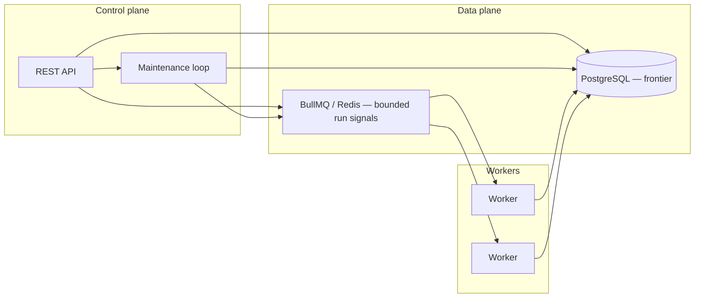
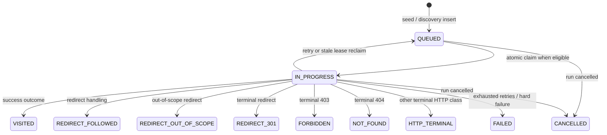

# Architecture

High-level view of the distributed crawler. **Postgres owns the canonical crawl frontier** (`crawl_urls`, run metadata). **Redis/BullMQ carries bounded run-level dispatch signals** (plus delayed retry wakeup signals). Workers **claim concrete URL rows from Postgres** after receiving a signal; BullMQ does **not** store a copy of every queued URL.

## URL state machine

Rows move between non-terminal and terminal **`crawl_urls.status`** values under atomic updates and run-scope guards. **`CANCELLED`** is a terminal URL status used when the crawl run is cancelled.

Non-terminal work for completion counting is primarily **`QUEUED`** and **`IN_PROGRESS`**. Run **`COMPLETED`** follows a stable-empty frontier check on those counts (see README).

## Crawl scope

Runs are started with a caller-provided **`seedUrl`**. The control plane persists **`normalized_seed_url`**, **`seed_url`**, and **`allowed_hosts`** on `crawl_runs`. Workers load `allowed_hosts` when parsing HTML so link normalization stays within that **strict two-host** scope (no arbitrary subdomains).

## Why Postgres is source of truth

- Every URL row has a unique `(crawl_run_id, normalized_url)` and a lifecycle `status`.
- Workers compete via **atomic** `QUEUED → IN_PROGRESS` updates; duplicate Redis signals cannot double-visit a URL.
- Reconciliation reads claimable **`QUEUED`** rows from Postgres and **tops up bounded BullMQ signals**, so commit/enqueue skew cannot strand work permanently.

## Why Redis / BullMQ exists next to Postgres

- BullMQ schedules **bounded concurrent wakeups** across processes (including **delayed retry wakeup jobs**) without tight Postgres polling loops on every worker.
- Each **dispatch signal** is a single **claim opportunity**: the worker loads run context, runs **`claimNextQueuedUrl`**, and may process zero or one URL depending on eligibility (`RUNNING` run, **`retry_after_at`**, empty frontier, etc.).
- Signal volume scales roughly with **`DISPATCH_SIGNALS_PER_RUN × active runs`** plus delayed retries—not with total discovered URL cardinality.

## Reconciliation and lease recovery

- **Reconciliation**: for each **`RUNNING`** crawl with claimable **`QUEUED`** URLs (respecting **`retry_after_at`**), **replenish bounded run signals** up to the configured cap. This is **not** “enqueue one BullMQ job per URL row.”
- **Lease recovery**: stale **`IN_PROGRESS`** rows revert to **`QUEUED`**; reconciliation then tops up signals so reclaimed work becomes claimable again.

## Cancellation

- **`POST /crawl-runs/:id/cancel`** targets **`RUNNING`** runs only (completed/failed/cancelled runs are a no-op with `changed: false`).
- A successful cancel marks **`crawl_runs.status = CANCELLED`**, sets **`completed_at`**, and sets **`QUEUED`** / **`IN_PROGRESS`** **`crawl_urls`** rows to **`CANCELLED`** (clearing leases).
- Workers still consume Redis signals briefly after cancel: **claim paths require the run to be `RUNNING`**, so drains do not schedule new URL work.
- In-flight HTTP cannot be force-aborted via this API alone; finalize paths are guarded so late writes do not overwrite **`CANCELLED`** rows incorrectly.

## Retry eligibility (`retry_after_at`)

On retryable failure the worker sets **`QUEUED`**, increments **`retry_count`**, and stores **`retry_after_at = now + delay`** in Postgres. **`claimNextQueuedUrl`** only selects rows whose **`retry_after_at` is null or ≤ now**. Optional **delayed BullMQ wakeup signals** approximate timely retries; reconciliation still converges if wakes are missed.

## Observability

- Control plane: `GET /metrics` (Prometheus text).
- Worker: `GET http://<worker>:9091/metrics` (separate HTTP server).
- Local stack: Prometheus scrapes both (see `docker-compose.yml` and `config/prometheus.yml`).
- See [observability.md](./observability.md) for metric meanings and “healthy run” guidance.
