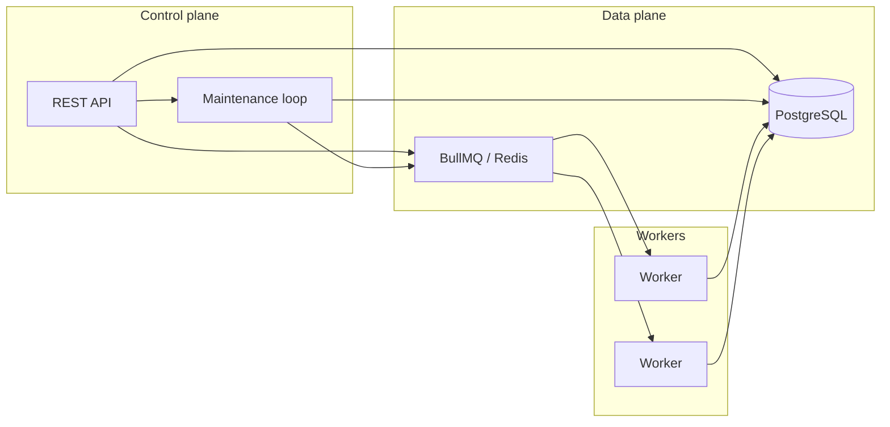
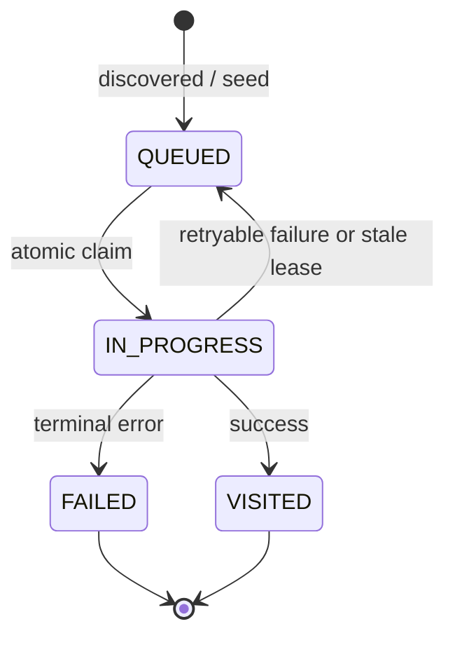

# Architecture

High-level view of the distributed crawler. Postgres owns crawl state; Redis/BullMQ is execution transport only.

## URL state machine

## Crawl scope

Runs are started with a caller-provided **`seedUrl`**. The control plane persists **`normalized_seed_url`**, **`seed_url`**, and **`allowed_hosts`** on `crawl_runs`. Workers load `allowed_hosts` when parsing HTML so link normalization stays within that **strict two-host** scope (no arbitrary subdomains).

## Why Postgres is source of truth

- Every URL row has a unique `(crawl_run_id, normalized_url)` and a lifecycle `status`.
- Workers compete via **atomic** `QUEUED → IN_PROGRESS` updates; duplicates in Redis cannot double-visit a URL.
- Reconciliation re-reads `QUEUED` rows from Postgres, so enqueue gaps after DB commit cannot lose work permanently.

## Why Redis / BullMQ is execution transport

- BullMQ schedules work across processes with delays (retries/backoff).
- Queue payloads are tiny (`crawl_run_id`, `url_id`); the queue does not need to mirror the full frontier.

## Reconciliation and lease recovery

- **Reconciliation**: periodically enqueue all `QUEUED` rows again (idempotent at claim layer).
- **Lease recovery**: stale `IN_PROGRESS` rows (expired `claimed_at`) return to `QUEUED` and are re-enqueued.

## Observability

- Control plane: `GET /metrics` (Prometheus text).
- Worker: `GET http://<worker>:9091/metrics` (separate HTTP server).
- Local stack: Prometheus scrapes both (see `docker-compose.yml` and `config/prometheus.yml`).
- See [observability.md](./observability.md) for metric meanings and “healthy run” guidance.
